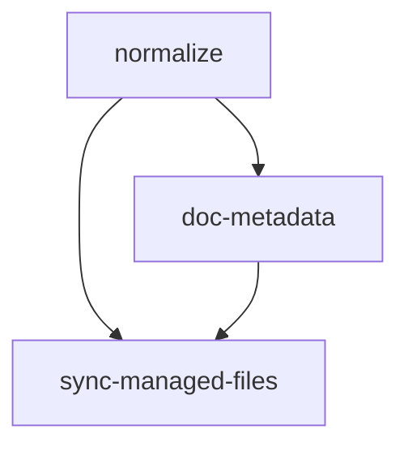

# Repository maintenance

## Purpose

[repository-maintenance.yml](../repository-maintenance.yml) is the central repository-maintenance orchestrator for this directory. It owns the normal maintenance triggers, normalizes event context into a stable set of outputs, and invokes the child workflows in the intended order.

## When it runs

| Trigger | Active or passive | Notes |
| --- | --- | --- |
| `pull_request` | Active/orchestrating | Runs repository maintenance for pull requests and lets normalized outputs decide which child workflows are in scope. |
| `push` | Active/orchestrating | Branch-only push trigger owned by the orchestrator. Child workflows do not own direct push routing. |
| `schedule` | Active/orchestrating | Owns the maintenance schedule. Child workflows do not own schedules. |
| `workflow_dispatch` | Active/orchestrating | Manual maintenance entry point. Scope still depends on normalized branch context. |

> [!IMPORTANT]
> Scheduling is intentionally owned here, not in the child workflows.

## Workflow role

This workflow is the central orchestrator.

It is responsible for:

- owning maintenance triggers for the `.github/workflows` maintenance surface,
- normalizing event context into stable outputs for reusable child workflows,
- calling [Document metadata](doc-metadata.md) first,
- calling [Sync managed files](sync-managed-files.md) last,
- and enforcing the skip/failure contract between those child workflows.

## Execution flow

1. `normalize` computes the effective maintenance context from the current GitHub event.
2. `doc-metadata` runs first when normalized outputs say document metadata is in scope.
3. `sync-managed-files` runs last when managed-file sync is in scope and the doc-metadata result satisfies the orchestration contract.

> [!IMPORTANT]
> The orchestrator intentionally allows managed-file sync to run when document metadata is out of scope. It allows sync after document metadata success. It must not run sync when document metadata was expected but skipped, failed, or was cancelled.

## Inputs

### `workflow_dispatch`

This workflow currently defines no custom manual-dispatch inputs.

### Normalized outputs passed to child workflows

The orchestrator computes and forwards normalized values such as the effective event name, branch/ref context, PR SHA context, and a compact event-payload JSON representation needed by child workflows.

| Output family | Used by | Purpose |
| --- | --- | --- |
| Effective event/ref context | Both child workflows | Keeps reusable workflows from depending on implicit caller event context, including normalized branch vs tag context for direct dispatch decisions. |
| PR base/head context | `doc-metadata.yml` | Preserves existing metadata comparison and repair routing behavior. |
| Scope booleans | Orchestrator jobs | Determines whether each child workflow should run for the current event. |

## Examples

| Scenario | Trigger context | `doc-metadata` | `sync-managed-files` | Notes |
| --- | --- | --- | --- | --- |
| Pull request targeting the default branch | `pull_request` with `base_ref == default_branch` | Runs | Runs after doc-metadata succeeds | This is the full orchestrated maintenance path for PRs into the default branch. |
| Push to `main` or `master` | `push` on a branch named `main` or `master` | Runs | Runs only when the pushed branch is also the repository default branch | Doc-metadata accepts either common primary branch name. Sync remains tied to the actual configured default branch. |
| Scheduled maintenance | `schedule` with `17 3 * * *` | Skips | Runs | The schedule is daily at 03:17 UTC and is owned only by this orchestrator. |
| Manual run from the default branch | `workflow_dispatch` with `ref_type == 'branch'` and `ref_name == default_branch` | Runs | Runs after doc-metadata succeeds | This is the supported direct maintenance entry point for a full manual run. |
| Manual run from a non-default branch | `workflow_dispatch` with `ref_type == 'branch'` and `ref_name != default_branch` | Runs | Skips | This supports targeted metadata maintenance without manifest sync. |

## Permissions and secrets

| Job | Permissions | Secrets |
| --- | --- | --- |
| `normalize` | none | none |
| `doc-metadata` call job | `contents: write`, `pull-requests: write` | inherited repository/job token context used by the child workflow |
| `sync-managed-files` call job | `contents: write`, `pull-requests: write` | inherited secrets so the child wrapper can forward `SOURCE_REPO_READ_TOKEN` when needed |

## Important behavior notes

- This workflow is the only normal trigger owner for maintenance routing in this directory.
- Push-based maintenance is intentionally branch-only.
- The orchestrator protects against cross-event cancellation collisions by including the event name in the top-level concurrency group.
- Child workflows remain directly dispatchable for targeted manual runs, but normal repository routing is centralized here.

> [!WARNING]
> Do not move schedule, push, or pull-request trigger ownership back into child workflows unless the orchestration contract is intentionally being redesigned.

## Related workflows

- [Document metadata](doc-metadata.md)
- [Sync managed files](sync-managed-files.md)
- [repository-maintenance.yml](../repository-maintenance.yml)

## Maintenance notes

- Safe edits here include trigger documentation, normalized-context explanations, and the ordering contract.
- Treat the doc-metadata-before-sync ordering and the sync skip/failure contract as behavior boundaries, not optional implementation details.
- If child workflow inputs change, update this file to reflect the new normalized context that is forwarded.
- Do not document future orchestration branches or workflows until the YAML exists.