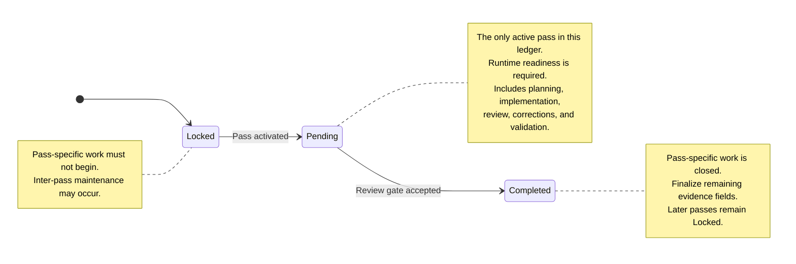

# Evidence Ledger Protocol

The evidence ledger records the lifecycle and accepted evidence of ordered backlog passes. It maps each pass state to immutable Git history and provides blocking conditions that prevent work from starting against incomplete, stale, or contradictory coordination data.

Updating the ledger must follow the workflow defined here. Ad hoc updates can create ambiguous baselines, incomplete closure records, or invalid pass transitions.

## Authority and precedence

The evidence-ledger workflow uses the following authority model:

1. The current user prompt supplies write authority.
2. The project backlog owns stable project roadmap and pass-contract data: identity, order, dependencies, scope, acceptance criteria, and project-specific exceptions.
3. The project evidence ledger is the sole mutable authority for lifecycle status, accepted SHAs, run evidence, reviewer state, and associated lifecycle metadata.
4. The repository review protocol defines mandatory start, stop, review, and authorization gates.
5. This document defines reusable ledger-column semantics, state transitions, and population timing.
6. Repository instructions define protected control-plane and execution rules.

If these sources conflict, stop before beginning or continuing pass-specific work. Resolve the conflict through a maintainer-controlled governance update.

The evidence ledger and its supporting documentation do not independently authorize repository changes.

The centrally maintained seed `evidence-ledger.md` contains no project rows. Only its provisioned project-owned copy at `project-backlog/evidence-ledger.md` becomes the default lane's mutable workflow state. If a project explicitly enables independent parallel lanes, each additional lane requires separately governed, project-owned ledger state whose path and authority boundaries are declared in the project backlog; this protocol does not prescribe a generic filename. Engineering Evidence Archive, if integrated later, may store downstream artifacts but is never lifecycle, acceptance, or ledger authority.

Activation in this protocol means activating a project pass through a ledger transition. It does not mean repository-level workflow adoption, provisioning, or automatic agent or skill activation; those integration concerns are defined separately when adopted.

## Terminology

* **Pass** — One ordered backlog item.
* **Lifecycle lane** — One independently governed evidence ledger and the strictly ordered pass lifecycle recorded in that ledger.
* **Current pass** — The pass whose status is `Pending` in the selected independently governed ledger/lane.
* **Previous pass** — The immediately preceding pass in the selected lane according to the project backlog's current governed order and dependency contract.
* **Later pass** — Any pass after the current or selected pass in the selected lane.
* **Pass-specific work** — Planning, implementation, review, correction, or validation performed to satisfy one pass.
* **Inter-pass maintenance** — Coordination, governance, cleanup, or other approved work performed after one pass is complete and before another pass is activated.
* **Fully finalized row** — A completed-pass ledger row in which every required evidence field has been populated and the required post-integration commit reachability has been verified.
* **Activation commit** — The commit on the target branch that changes one eligible pass from `Locked` to `Pending`.
* **Execution lease** — The exact activation-commit SHA plus the actual target/pass-branch topology, expected pass-branch HEAD, allowed post-baseline commits, and worktree state recorded in the finalized pass handoff after the pass branch exists.
* **Result commit** — The accepted commit containing the pass-specific result.
* **Review-gate closure commit** — The maintainer-controlled commit that marks the pass `Completed` and records accepted review evidence.
* **Post-merge finalization commit** — A later commit that records values that could not be recorded in the review-gate closure commit, such as the closure commit's SHA and the delivering pull-request number.

## Ledger columns

| Column                    | Meaning                                                                       | Value established                                        | Ledger populated                                   |
| ------------------------- | ----------------------------------------------------------------------------- | -------------------------------------------------------- | -------------------------------------------------- |
| `Pass`                    | Stable backlog identifier                                                     | When the pass is admitted to the project backlog         | Added when admitted; never reused or duplicated    |
| `Status`                  | Pass progression state                                                        | At each state transition                                 | In the transition commit                           |
| `Pre-pass baseline SHA`   | Exact activation snapshot used by the execution lease                         | When the activation commit is created                    | When the pass is closed                            |
| `Result SHA`              | Accepted commit containing the pass-specific result                           | When the final reviewed result commit is selected        | When the pass is closed                            |
| `PR #`                    | Pull request that delivered the accepted pass result and closure state        | When the pull request is merged                          | In the post-merge finalization commit              |
| `Review-gate closure SHA` | Commit that marked the pass `Completed` and recorded accepted review evidence | When the review-gate closure commit is created           | In the post-merge finalization commit              |
| `Tests/runs`              | Concise accepted validation and review evidence                               | At review acceptance                                     | In the review-gate closure commit                  |
| `Reviewer`                | Maintainer or reviewer who accepted the review gate                           | At review acceptance                                     | In the review-gate closure commit                  |

> [!IMPORTANT]
> Every ledger row must correlate to exactly one pass identifier in the project backlog. The backlog remains authoritative for identity, order, dependencies, scope, and acceptance criteria; the ledger remains authoritative for mutable lifecycle state and accepted evidence.
>
> A governed roadmap change may add or revise future pass contracts. Reconcile the ledger identities required by that change without copying lifecycle status into the backlog or rewriting accepted evidence.

### Special values

For a pure review pass that produces no repository result commit, use:

```text
N/A — review-only; no repository change
```

in `Result SHA`.

When no pull request delivered the result, use:

```text
N/A
```

in `PR #`.

Do not use a bookkeeping, activation, closure, merge, or finalization commit as the `Result SHA` unless that commit actually contains the accepted pass-specific result.

## Self-reference and delayed population

A commit cannot contain its own final SHA.

The `Review-gate closure SHA` must therefore be populated in a later commit. Similarly, the delivering pull-request number is finalized after merge.

A pass may consequently have:

* `Status` set to `Completed`;
* accepted `Result SHA`, `Tests/runs`, and `Reviewer` recorded;
* but temporarily empty `PR #` and `Review-gate closure SHA` cells.

This is a valid intermediate closure state.

The row is not **fully finalized** until all required fields have been populated. No later pass may be activated before that finalization is complete.

## States

The ledger follows strict state-transition rules.

One independently governed evidence ledger defines one strictly ordered lifecycle lane. At most one pass may have `Pending` status within that ledger/lane, and zero pending passes in a lane is valid, including during inter-pass maintenance and ledger finalization. A `Pending` pass in one independent lane does not invalidate a `Pending` pass in another.

Parallel execution is valid only when the project backlog explicitly identifies separate ledger state, independent authority boundaries, governed dependencies, and integration ordering for each independent lane. Arbitrary multiple pending rows in one ledger remain invalid.

Violating the state, ordering, or evidence rules creates a blocking condition that must be resolved before pass-specific work can proceed.

### Status glossary

| Status      | Meaning                                                                                                                                                                                                                                                                            |
| ----------- | ---------------------------------------------------------------------------------------------------------------------------------------------------------------------------------------------------------------------------------------------------------------------------------- |
| `Locked`    | The pass has not been activated. Pass-specific work must not begin. A pass remains locked while its predecessor is incomplete, while the predecessor’s row is awaiting finalization, while inter-pass maintenance is in progress, or until the maintainer explicitly activates it. |
| `Pending`   | The pass is the only active pass in this ledger/lane. Its activation commit has been created. Pass-specific work remains blocked until its pass branch exists, the handoff contains the actual execution lease, post-activation readiness is `Ready`, and the explicit execution directive is issued. |
| `Completed` | The maintainer has accepted the pass result and closed pass-specific work. The next pass remains `Locked`. Post-merge evidence fields may still require finalization.                                                                                                              |



## Locked state

### Entry

A pass begins in `Locked`.

A later pass also remains `Locked` while:

* the previous pass is incomplete;
* the previous pass’s ledger row is not fully finalized;
* governance or maintenance work is underway;
* the maintainer has not explicitly selected it for activation.

### Exit transition

```text
Locked → Pending
```

The transition is performed only through the activation workflow.

## Activated state

### State name

```text
Pending
```

### Entry transition

```text
Locked → Pending
```

### Exit transition

```text
Pending → Completed
```

### Required preconditions

Before activation:

1. Every required predecessor, including any cross-lane predecessor, has status `Completed`.
2. Every required predecessor row is fully finalized, including verified accepted-commit reachability from its target branch.
3. All approved inter-pass maintenance is complete.
4. The selected pass appears exactly once in both the backlog and ledger and has status `Locked` in the ledger.
5. The selected pass's backlog dependencies are satisfied.
6. Every ineligible later or dependent pass remains `Locked`.
7. No required ledger row is missing, duplicated, or contradictory with the backlog's identity and ordering contract.
8. The target branch is in the expected reviewed state.
9. A draft handoff exists while the selected pass remains `Locked` and describes the intended topology and required shape of the future execution lease.
10. The pre-activation authorization review defined by the review protocol has succeeded and records `Authorization state: Authorized for activation`.
11. The maintainer has explicitly authorized the activation update.

If any condition fails, do not activate the pass.

### Activation procedure

1. Select the next eligible locked pass and draft its handoff.
2. Complete the pre-activation authorization review while that pass remains `Locked`.
3. Change only that pass’s `Status` from `Locked` to `Pending`.
4. Commit the activation change on the target branch.
5. Resolve the exact activation-commit SHA.
6. Create the pass branch from exactly that activation commit.
7. Finalize the handoff with the actual activation SHA, branch topology, expected pass-branch HEAD, allowed post-baseline commits, and worktree state.
8. Leave the pass’s `Pre-pass baseline SHA` ledger cell empty.
9. Perform the narrow post-activation execution-readiness validation.
10. Record `Execution readiness: Ready` or `Execution readiness: Blocked`.
11. Issue the explicit execution directive only when readiness is `Ready`.
12. Have the executor recheck the lease and start gate before beginning pass-specific work.

The activation commit should be a dedicated coordination commit. Any additional content in it must be explicitly approved, reviewed, and intended to form part of the pass baseline.

> [!IMPORTANT]
> The pass is activated when the `Locked` → `Pending` transition is committed on the target branch.
>
> Pass-specific work starts only after the pass branch has been created from that activation commit, the handoff has been finalized with actual runtime state, readiness is `Ready`, and the explicit execution directive has been issued.

> [!IMPORTANT]
> The pre-pass baseline is not entered into the active pass’s ledger row at activation time. Recording it before committing the activation transition would create a trailing SHA reference.
>
> The accepted baseline is recorded later, when the pass is closed.

### Post-activation execution-readiness checks

After the branch is created and the handoff is finalized, validate actual runtime state:

1. Resolve the exact activation commit recorded in the finalized handoff.
2. Confirm that the pass branch was created from that commit and has the expected HEAD.
3. Confirm target/pass-branch topology and ancestry.
4. Inspect every allowed commit after the baseline.
5. Confirm that no unexpected or unapproved change exists.
6. Confirm that the target-branch and pass-branch leases have not moved unexpectedly.
7. Confirm that the working tree has the required cleanliness.
8. Confirm that all runtime state is consistent with the finalized handoff.

Record exactly one result:

```text
Execution readiness: Ready
```

or:

```text
Execution readiness: Blocked
```

This is a narrow runtime validation after authorization, not a second broad authorization review. It must not reopen accepted product intent merely because actual lease values have been populated. If readiness is blocked, do not issue the execution directive or begin pass-specific work; use the already authorized recovery or coordination semantics.

Immediately before planning or editing, and again in the final pass report, the executor rechecks the same lease and start-gate facts.

The pre-pass baseline is the rollback and comparison point. It is not defined merely by `git merge-base`, although the activation workflow should normally make it both the branch point and direct parent of the first pass-specific commit.

Preparation or maintenance changes that must survive a rollback belong before the activation commit.

### Pending-state invariant

The pass remains `Pending` throughout:

* planning;
* implementation;
* validation;
* review;
* corrections;
* repeated review;
* preparation of the accepted result.

Passing tests or producing an agent self-review does not transition the pass to `Completed`.

Only maintainer acceptance of the review gate authorizes completion.

## Accepted and closed state

### State name

```text
Completed
```

### Entry transition

```text
Pending → Completed
```

### Exit transition

None.

A completed pass never returns to `Pending`. Defects found after completion require an explicitly authorized follow-up pass or reopening procedure defined by the owning project.

### Completion preconditions

The transition is allowed only when:

1. The pass-specific result is complete.
2. The complete diff or review output has been independently reviewed.
3. The review gate has been accepted by the maintainer.
4. Required validation and review evidence is available.
5. The accepted result commit has been identified, or the pass is confirmed as review-only.
6. The historical pre-pass baseline has been verified.
7. No stop condition remains unresolved.
8. The maintainer has explicitly authorized the control-plane closure update.

### Before merging

Perform a maintainer-controlled, coordination-only closure update:

1. Populate the historical `Pre-pass baseline SHA`.
2. Populate the accepted `Result SHA`, or the review-only `N/A` value.
3. Populate `Tests/runs`.
4. Populate `Reviewer`.
5. Change `Status` from `Pending` to `Completed`.
6. Leave every later pass `Locked`.
7. Commit this as the review-gate closure commit.
8. Resolve and retain the exact review-gate closure SHA.
9. Validate the closure diff and choose an identity-preserving integration strategy.
10. Merge through the approved repository process.

The review-gate closure commit:

* must be explicitly authorized;
* must modify only approved control-plane fields;
* must not alter pass-result files;
* is not the pass `Result SHA`;
* does not activate the next pass.

### Closure validation

Before merging the closure update:

* confirm the accepted `Result SHA` is unchanged;
* confirm the recorded baseline matches the executed handoff;
* confirm validation evidence and reviewer are present;
* confirm the pass appears exactly once;
* confirm every later pass remains `Locked`;
* confirm no unrelated control-plane field changed;
* confirm the planned merge/integration strategy preserves the accepted result commit, except explicit review-only `N/A`, and the review-gate closure commit as reachable identities on the target branch;
* reject squash merge, rebase-and-merge, cherry-pick-based replacement, or any other strategy that rewrites those accepted identities;
* run `git diff --check`;
* perform the repository’s required Markdown and link checks.

Allowed normal integration includes a merge commit, a fast-forward, or another strategy demonstrably preserving the existing commit identities. Version 1 defines no rewrite or SHA-remapping protocol.

### After merging

Before finalizing the completed pass row, verify that the accepted commits remain reachable from the target branch:

```text
git merge-base --is-ancestor <RESULT-SHA> <TARGET-REF>
git merge-base --is-ancestor <CLOSURE-SHA> <TARGET-REF>
```

The result check is required only when a real result commit exists; omit it for the explicit review-only `N/A`. If a required reachability check fails, do not finalize the row or activate dependent work. An identity-rewriting merge cannot be repaired by substituting new SHAs into the ledger under the normal lifecycle.

After reachability succeeds, finalize the completed pass row:

1. Populate the delivering `PR #`, or explicit `N/A`.
2. Populate the unchanged `Review-gate closure SHA`.
3. Commit the finalized completed row.
4. Perform any remaining approved inter-pass maintenance.
5. Keep every later pass `Locked`.

The completed pass lifecycle ends here.

To begin another pass, select the next eligible locked pass and follow the [Activated state](#activated-state) procedure. Activation is a separate state transition for the selected pass and is not part of completing the previous pass.

## Fully finalized row

A completed pass row is fully finalized only when it contains:

* `Status: Completed`;
* historical `Pre-pass baseline SHA`;
* accepted `Result SHA`, or the required review-only value;
* `PR #`, or explicit `N/A`;
* `Review-gate closure SHA`;
* accepted `Tests/runs`;
* `Reviewer`;
* verification that every real accepted result commit and the review-gate closure commit remain reachable from the target branch.

A later or cross-lane dependent pass must remain `Locked` until every required predecessor row is fully finalized, its required reachability is verified, and all inter-pass maintenance is complete.

## Start gate for a pending pass

Before pass-specific work begins, verify:

1. Every required predecessor pass, including any cross-lane predecessor, is fully finalized and has the required accepted-commit reachability.
2. The selected pass appears exactly once.
3. The selected pass has status `Pending`.
4. Its evidence cells other than `Pass` and `Status` are still empty.
5. No other pass in the selected independently governed ledger/lane is `Pending`.
6. Every later or dependent pass in the selected lane remains `Locked`.
7. The finalized task handoff supplies the exact activation-commit SHA and actual execution lease.
8. The pass branch was created from exactly that activation commit.
9. No unexpected post-baseline commit or working-tree change exists.
10. Post-activation readiness is recorded as `Execution readiness: Ready`.
11. The explicit execution directive has been issued.
12. All applicable instructions and control-plane documents agree.

If any condition fails, stop and report the exact integrity defect.

## Blocking conditions

Pass-specific work must not begin or continue when any of the following is true:

* more than one pass is `Pending` in one independently governed ledger/lane;
* a pass is `Pending` while a same-lane or cross-lane predecessor row is incomplete or lacks required reachability;
* a later or dependent pass in the selected lane is not `Locked`;
* the ledger row set or presentation order contradicts the current governed backlog;
* the backlog duplicates or contradicts ledger lifecycle status;
* a completed row lacks required accepted evidence when a later pass is activated;
* the task-supplied baseline cannot be resolved;
* the pass branch does not descend from the supplied baseline;
* unexpected changes exist after the baseline;
* the target branch or pass branch moved during a leased review;
* post-activation readiness is missing or `Blocked`;
* normal integration would rewrite accepted result or review-gate closure commit identities;
* a required accepted commit is not reachable from the target branch after integration;
* the ledger, backlog, review protocol, or repository instructions contradict one another;
* a protected control-plane update lacks explicit authorization.

Resolve the contradiction through a maintainer-controlled governance or coordination update before resuming.

## Core invariants

The ledger workflow preserves these invariants:

1. One independently governed evidence ledger defines one strictly ordered lifecycle lane.
2. At most one pass is `Pending` within a ledger/lane.
3. Zero pending passes in a ledger/lane is valid.
4. Parallel lanes require separate ledger state plus backlog-defined authority boundaries, dependencies, and integration ordering.
5. A pass cannot skip `Locked`.
6. A pass cannot transition directly from `Locked` to `Completed`.
7. A completed pass does not become pending again through the normal lifecycle; any reopening procedure preserves the accepted evidence and explicit project history.
8. Later or dependent passes in the selected lane remain locked throughout the current pass lifecycle.
9. The activation commit exists before pass-branch creation; the exact execution lease is finalized after branch creation and before work.
10. The baseline ledger cell is populated only after the pass result is known.
11. The review-gate closure commit does not activate the next pass.
12. Post-merge finalization and next-pass activation are separate operations.
13. A same-lane or cross-lane dependent pass is activated only after every required predecessor row is fully finalized, accepted-commit reachability is verified, and maintenance is complete.
14. Pass-result, review-gate closure, post-merge finalization, and next-pass activation commits remain semantically distinguishable.
15. Every recorded SHA has one explicit semantic role.
16. Normal integration preserves real accepted result and review-gate closure commit identities and their reachability from the target branch.
17. No ledger update depends on a commit containing its own SHA.
18. Project-specific historical exceptions are documented in the owning backlog, not in this reusable workflow document.
19. The backlog may evolve through governance, but it never becomes a second mutable lifecycle-state authority.

## Recommended commit separation

The workflow should normally produce distinct commits for distinct responsibilities:

1. **Pass-result commit**

   * contains the accepted pass-specific result;
   * becomes `Result SHA`.

2. **Review-gate closure commit**

   * records accepted baseline, result, evidence, reviewer, and status;
   * becomes `Review-gate closure SHA`;
   * leaves later passes locked.

3. **Post-merge finalization commit**

   * follows successful result/closure reachability checks;
   * records the PR number and unchanged closure SHA;
   * may be followed by additional maintenance;
   * leaves later passes locked.

4. **Next-pass activation commit**

   * changes only the next eligible pass from `Locked` to `Pending`;
   * becomes that pass’s pre-pass baseline;
   * precedes pass-branch creation, finalized lease population, and post-activation readiness validation.

Combining these responsibilities should be treated as an exception requiring explicit justification and review.

## Reuse guidance

This document intentionally defines a general ledger workflow.

Project-specific roadmap and contract information belongs in the owning backlog, including:

* historical exceptions;
* pass identifiers;
* repository names;
* project-specific maintenance requirements;
* deviations made before this workflow was adopted;
* for each explicitly enabled independent lane, its additional ledger path, authority boundaries, dependencies, and integration ordering.

Mutable lifecycle and evidence values belong in the owning project evidence ledger, including accepted SHAs, pull-request numbers, tests or runs, and reviewer identity.

A project that adopts this workflow should ensure that backlog and ledger pass identities agree, and that its review protocol, repository instructions, and ledger table use the state and column definitions established here.
